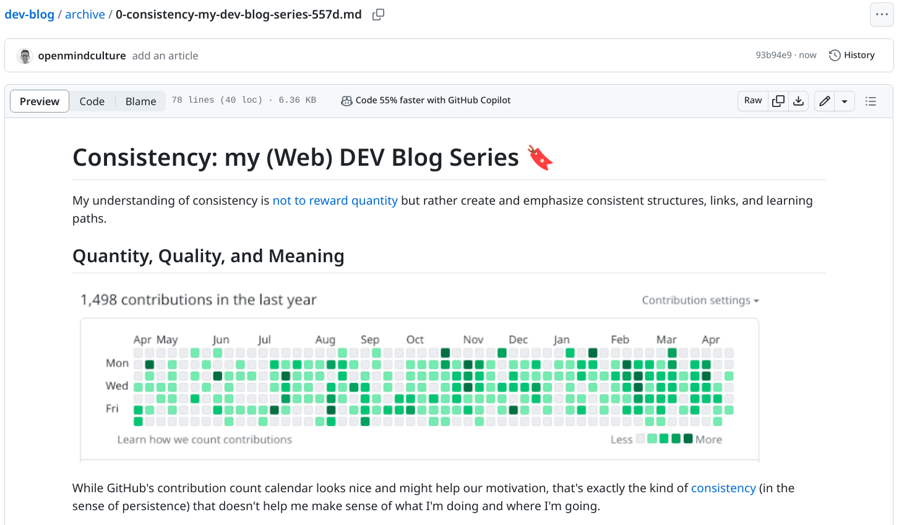

# Ingo Steinke's dev-blog post archive

Ingo Steinke's blog post archive featuring markdown and PDF copies of web development articles published on DEV, Open Mind Culture, and other sites.

Ingo Steinke is a creative web developer, helping to build a fast and friendly, accessible, ethical and ecological word wide web.

## Blog Sources

- https://dev.to/ingosteinke
- https://www.open-mind-culture.org
- https://medium.com/@ingosteinke/about
- https://tealfeed.com/openmindculture
- https://hashnode.com/@ingosteinke
- https://substack.com/profile/50727242-ingo-steinke
- https://www.ingo-steinke.com/

## Blog Archive

[archive/](archive/)

- [0-consistency-my-dev-blog-series-557d.md](https://github.com/openmindculture/dev-blog/blob/main/archive/0-consistency-my-dev-blog-series-557d.md)